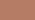
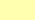
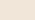
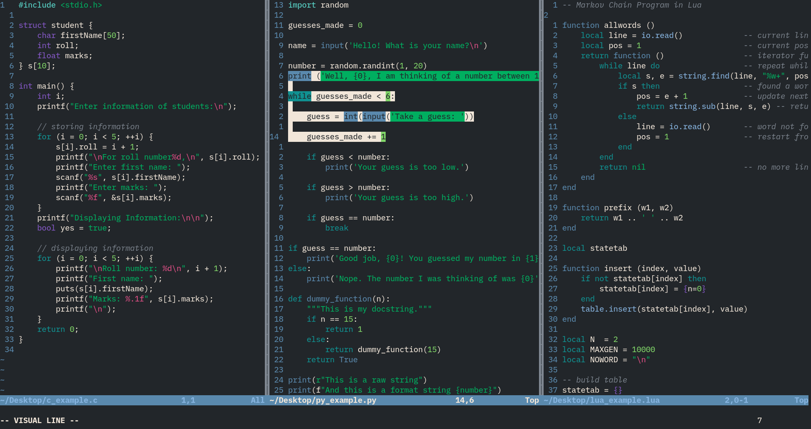

# Verdurous

A dark, forest theme.

In part inspired by the Flat Love palette by Atomic Tangerine (see
[here](https://www.colourlovers.com/palette/3182748/Flat_love)), which I was
happy enough to stumble upon while checking that the name `verdurous` was not
already in use. Additional inspiration was derived from the popular Nord
colorscheme, as well as from suggestions from friends and family.

This theme makes use of a palette of 16 base colors (see below), this allows for
ready compatibility with many terminal based applications.

| ANSI color number | Hex code  | Color                            | Description                                  |
|------------------:|:---------:|:--------------------------------:|:---------------------------------------------|
| 0                 | `#22262A` |  | A moderate dark grey with a tinge of blue    |
| 1                 | `#BF4052` |  | A deep red                                   |
| 2                 | `#00AF60` |  | The basis for this theme, a verdant green    |
| 3                 | `#B57C65` |  | Brown supersedes orange in this forest theme |
| 4                 | `#5A89AD` |  | A silvery blue, hailing from the Nord theme  |
| 5                 | `#8558C7` |  | A royal purple                               |
| 6                 | `#109191` |  | A fairly standard aqua                       |
| 7                 | `#808892` |  | A brighter variant of Tomb                   |
| 8                 | `#384048` |  | Inspired by Tomb of the Flat Love palette    |
| 9                 | `#E04F86` |  | A beautiful hot pink, perfect for highlights |
| 10                | `#80D468` |  | A grassy green                               |
| 11                | `#FFFFAF` |  | A banana-yellow                              |
| 12                | `#87B4E0` |  | A bright silvery blue, reminiscient of Nord  |
| 13                | `#D668E1` |  | A heliotrope purple                          |
| 14                | `#5BDDD0` |  | A shiny bright teal                          |
| 15                | `#F1E6D9` |  | A slightly creamy white, a recommendation    |

### Gallery

### Files

##### `dark/vim.vim`
The verdurous colorscheme for vim. Use `set termguicolors` in your `.vimrc` to
use this theme out of the box. Otherwise, you can use verdurous' 16 color
palette with your terminal emulator of choice.

##### `deploy_nvim.sh`
A small shell script that will create a skeleton
`~/.config/nvim/colors/verdurous.vim` that will simply source
`~/verdurous/verdurous.vim`. One can then add any of their own changes to the
system's file.

Note that this assumes that you've put this repo in your home folder.

##### `gallery/`
Contains all the images you see here in this readme!
