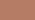
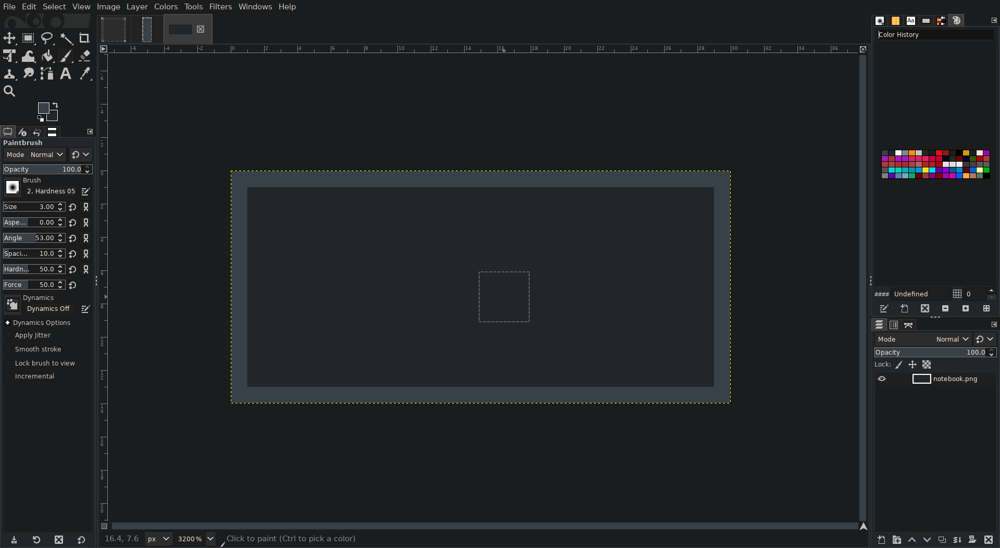
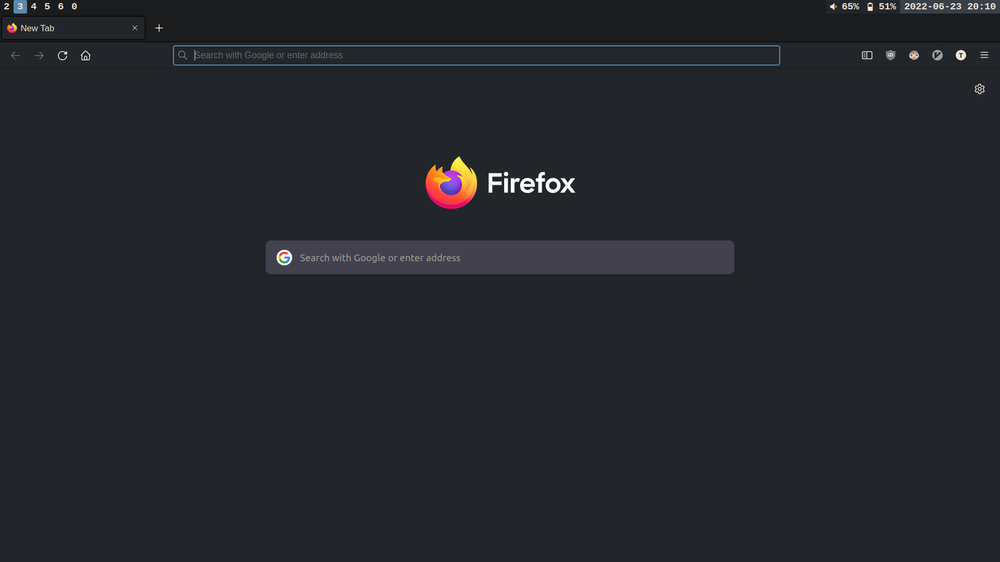

# Verdurous

A dark, forest theme.

In part inspired by the Flat Love palette by Atomic Tangerine (see
[here](https://www.colourlovers.com/palette/3182748/Flat_love)), which I was
happy enough to stumble upon while checking that the name `verdurous` was not
already in use. Additional inspiration was derived from the popular Nord
colorscheme, as well as from suggestions from friends and family.

This theme makes use of a palette of 16 base colors (see below) in addition to a
base background and foreground color, this allows for ready compatibility with
many terminal based applications.

| ANSI color number | Hex code  | Color                                    | Description                                  |
|------------------:|:---------:|:----------------------------------------:|:---------------------------------------------|
| 0                 | `#22262A` |  | A moderate dark grey with a tinge of blue    |
| 1                 | `#BF4052` |  | A deep red                                   |
| 2                 | `#00AF60` |  | The basis for this theme, a verdant green    |
| 3                 | `#B57C65` |  | Brown supersedes orange in this forest theme |
| 4                 | `#5A89AD` |  | A silvery blue, hailing from the Nord theme  |
| 5                 | `#8558C7` |  | A royal purple                               |
| 6                 | `#109191` |  | A fairly standard aqua                       |
| 7                 | `#808892` |  | A brighter variant of Tomb                   |
| 8                 | `#384048` |  | Inspired by Tomb of the Flat Love palette    |
| 9                 | `#E04F86` |  | A beautiful hot pink, perfect for highlights |
| 10                | `#80D468` |  | A grassy green                               |
| 11                | `#FFE958` |  | A vibrant yellow                             |
| 12                | `#87B4E0` |  | A bright silvery blue, reminiscient of Nord  |
| 13                | `#D668E1` |  | A heliotrope purple                          |
| 14                | `#5BDDD0` |  | A shiny bright teal                          |
| 15                | `#C7C3BE` |  | A blend 5/7ths between `7` and `fg`          |
| bg                | `#1B1C1D` |  | A deep dark grey                             |
| fg                | `#F1E6D9` |  | A slightly creamy white, a recommendation    |

If you are on linux you can likely use the provided `deploy.sh` script to create
some skeleton config files in order to use these themes. These skeleton files
generally just source the themes in this repo, so you can add any of your own
changes to the end of the skeleton files and things should work.

### Gallery






### Themes

##### Vim
The verdurous colorscheme for vim. Set e.g. `colorscheme verdurous-dark` in your
`.vimrc` to use this theme. You can use `set termguicolors` in your `.vimrc` for
things to work out of the box. Otherwise, you can use verdurous' 16 color
palette with your terminal emulator of choice.

##### Firefox
The verdurous colorscheme for firefox. Also available at
<https://addons.mozilla.org/.../verdurous>.

Upload note: In order to be consumable by Firefox's addon system, this theme
will need to be packaged. E.g. with:
```sh
cd themes/firefox/verdurous-darker
zip -r -FS ../firefox-verdurous-darker.zip *
```
The `.zip` file can then be uploaded to <https://addons.mozilla.org>.

##### Thunderbird
Upload note: In order to be consumable by Thunderbird's addon system, this theme
will need to be packaged. E.g. with:
```sh
cd themes/thunderbird/verdurous-darker
zip -r -FS ../thunderbird-verdurous-darker.xpi *
```
The `.xpi` file can then be uploaded to <https://addons.thunderbird.net>.

##### GIMP

This colorscheme borrows heavily from the default Dark GIMP theme packaged with
GIMP 2.10. The Dark GIMP theme is copyright 2015-2016 Benoit Touchette, under
the GPL V3 (or higher), as such, the verdurous version(s) should also be
considered as licensed under the GPL V3 (or higher), see the license declaration
in the `gtkrc` file.

##### And others!
